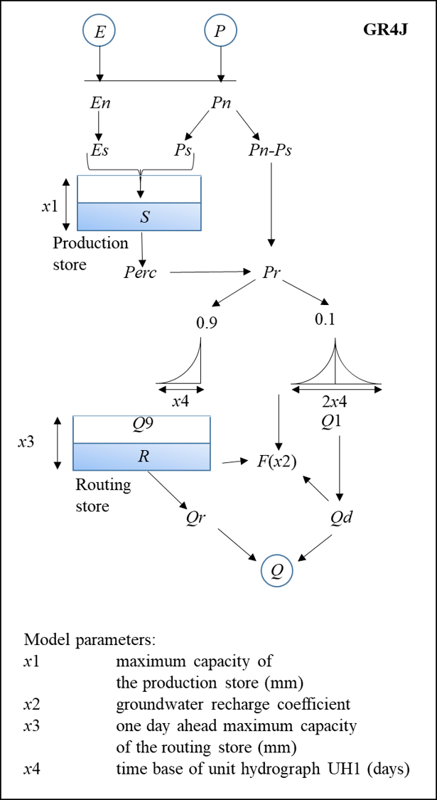

## GR4J hydrological model

the technical document about the GR4J hydrological model. 

### model structure

### Determination of net rainfall and PE

note $P$ the rainfall depth and $E$ the potential
evapotranspiration (PE) estimate that are inputs to the
model.

The first operation is the subtraction of $E$ from $P$ to determine
either a net rainfall $Pn$ or a net evapotranspiration
capacity $E_n$: In GR4J, this operation is computed as
if there were an interception storage of zero capacity.
$P_n$ and $E_n$ are computed with the following equations:

if $P>=E$, then $P_n=P-E$ and $E_n = 0$, otherwise $P_n=0$, and $E_n=E-P$.

### Production store

In case $Pn$ is not zero, a part $P_s$ of $P_n$ fills the production store. It is determined as a function of the level $S$ in the store by:

$$
P_s = \frac{x_1 (1 - \frac{S}{x_1}^2) \tanh{\frac{P_n}{x_1}}}{1+\frac{S}{x_1} \frac{P_n}{x_1}}
$$

where $x_1$ (mm) is the maximum capacity of the production store.

when $E_n$ is not zero, an actual
evaporation rate is determined as a function of the
level in the production store to calculate the quantity $E_s$ of water 
that that will evaporate from the store. It is
obtained by:

$$
E_s = \frac{S(2-\frac{S}{x_1})\tanh(\frac{E_n}{x_1})}{1+(1-\frac{S}{x_1}) \tanh(\frac{E_n}{x_1})}
$$

The water content in the production store is then
updated with:

$$
S=S-E_s + P_s
$$

Note that $S$ can never exceed $x_1$. 

A percolation leakage $Perc$ from the production
store is then calculated as a power function of
the reservoir content:

$$
Prec = S (1 - (1 + ( \frac{4S}{9x_1})^4)^{-1/4})
$$

$Prec$ is always lower than $S$. The reservoir content becomes: 

$$
S = S- Perc
$$

### Linear routing with unit hydrographs

The total quantity $P_r$ of water that reaches the routing functions
is given by:

$$
P_r = Perc + (P_n - P_s)
$$

$P_r$ is divided into two flow components according to a
fixed split: 90% of $P_r$ is routed by a unit hydrograph
UH1 and then a non-linear routing store, and the
remaining 10% of $P_r$ are routed by a single unit
hydrograph UH2. With UH1 and UH2, one can
simulate the time lag between the rainfall event and
the resulting streamflow peak. Their ordinates are
used in the model to spread effective rainfall over
several successive time steps. Both unit hydrographs
depend on the same time parameter $x_4$ expressed in
days. However, UH1 has a time base of $x_4$ days
whereas UH2 has a time base of $2x_4$ days. $x_4$ can take
real values and is greater than 0.5 days.

The ordinates of both unit hydrographs
are derived from the corresponding S-curves
(cumulative proportion of the input with time)
denoted by SH1 and SH2, respectively. SH1 is
defined along time $t$ by:

$$
t \leq 0, SH1(t)=0
$$

$$
0<t<x_4, SH1(t)=(\frac{t}{x_4})^{5/2}
$$

$$
t \geq x_4,SH1(t) = 1
$$

$$
UH1(j) = SH1(j) - SH1(j-1)
$$

The SH2 is derived by:

$$
0<t<x_4, SH2(t) = \frac{1}{2} (\frac{t}{x_4})^{5/2}
$$

$$
x_4 < t < 2x_4, SH2(t) = 1 -\frac{1}{2} (2 - \frac{t}{x_4}) ^{5/2}
$$

$$
t \geq 2 x_4, SH2(t) = 1
$$

$$
UH2(j) = SH2(j) - SH2(j-1)
$$

where $j$ is an integer. If $0.5 \leq x_4 \leq 1$, UH1 has a
single ordinate equal to one and UH2 has only two ordinates.

### Catchment water exchange

A groundwater exchange term F that acts on both flow components,
is then calculated as

$$
F = x_2 (\frac{R}{x_3})^{7/3}
$$

where $R$ is the level in the routing store, $x_3$ its
‘reference’ capacity and $x_2$ the water exchange coefficient.

### Non-linear routing store

The level in the routing
store is updated by adding the output Q9 of UH1 and
$F$ as follows:

$$
R=\max(0, R + Q9 + F)
$$

The outflow $Q_r$ of the reservoir is then calculated as:

$$
Q_r = R (1 - (1 + (\frac{R}{x_3})^4)^{-1/4})
$$

The level in the reservoir becomes $R=R-Q_r$.

## Total streamflow

Like the content of the routing
store, the output Q1 of UH2 is subject to the same water
exchange $F$ to give the flow component $Q_d$ as follows:

$$
Q_d = \max(0, Q1 + F)
$$

Total streamflow $Q$ is finally obtained by: $Q = Q_r + Q_d$.
